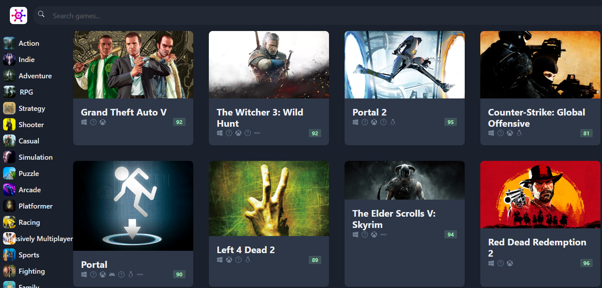

# Game Hub (React + TypeScript + Chakra UI + Vite)

[Live Site](https://game-hub2-khaki.vercel.app/)

# Description:
##### This project is done as part of the [Code With Mosh](https://codewithmosh.com) React course. 
##### The project uses API endpoints provided by [RAWGIO](https://rawg.io/apidocs).
